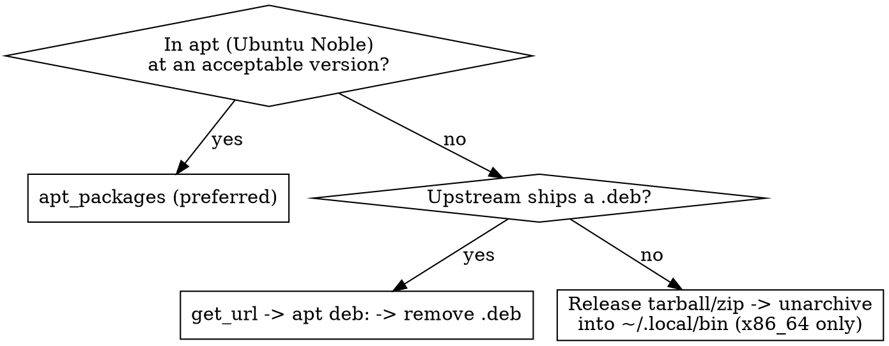

# Adding a Tool

## Core principle

**Every tool must install on both macOS and Debian/Ubuntu/WSL.** A task that only runs on one OS is a bug, not a
feature. Every existing task file already branches per-OS — follow that pattern (`modern-cli.yaml`, `tools.yaml`,
`yazi.yaml` are good models). Branch on `ansible_facts.os_family`: `"Darwin"` → Homebrew, `"Debian"` → apt / `.deb` /
release binary.

## Procedure

1. **Find the package name on each platform** and the latest stable version. macOS uses the Homebrew formula name (e.g.
   `git-delta`), Debian may differ or not exist in apt at all.
2. **Add config to `src/ansible/vars/main.yml`** — never inline package data in the task. Put brew formulae, apt package
   names, `.deb` URLs, and release-binary entries under a named key (see `modern_cli`).
3. **Write/extend a task file in `src/ansible/tasks/`** with OS-branched tasks (pattern below).
4. **Wire it into `local.yaml`** with an `import_tasks` line (only if it's a new file).
5. **Tag every task** — a broad tag (`initial-setup`) plus an area tag (e.g. `modern-cli`). This is how partial runs and
   the Docker `TAGS` arg work.
6. **Verify in Docker**, not on your real machine (see Verification).

## Choosing the Debian install method

macOS is always Homebrew. For Debian, pick the first that works, in this order:



## Task pattern

```yaml
# macOS
- name: "Install <tool> (macOS)"
  community.general.homebrew:
    name: "{{ mytool.brew_formulae }}"
    state: present
  when: ansible_facts.os_family == "Darwin"
  tags: [ initial-setup, <area> ]

# Debian: apt
- name: "Install <tool> via apt (Debian)"
  become: true
  ansible.builtin.apt:
    name: "{{ mytool.apt_packages }}"
    state: present
    update_cache: true
  when: ansible_facts.os_family == "Debian"
  tags: [ initial-setup, <area> ]
```

For release binaries on Debian, follow `modern-cli.yaml`: ensure `~/.local/bin` exists (already on PATH), `unarchive`
with per-asset `extra_opts` to normalize layout (`--strip-components=1` for nested tarballs, `-j` for flat zips), set
the binary executable, and use `creates:` for idempotency. For `.zip` assets, `unzip` must be installed first.

## Version pinning

**If you must pin a version, check the latest stable release FIRST** (GitHub releases / `brew info` / upstream) and pin
to that — do not pin to whatever version a stale example happens to show. Pins live in `src/ansible/vars/main.yml` (e.g.
`modern_cli_versions`). Prefer leaving package-manager installs unpinned (`state: present`); pin only release binaries /
`.deb` URLs where the version is part of the download path.

## Guardrails

| Guardrail                                                         | Why                                                                          |
|-------------------------------------------------------------------|------------------------------------------------------------------------------|
| Branch on `os_family` for every install task                      | A bare apt task silently breaks macOS; this is the #1 mistake here.          |
| Package data → `vars/main.yml`, not inline                        | Single source of truth the whole migration reuses.                           |
| Clean up downloads (`.deb`, installers, temp) in a follow-up task | Matches existing tasks (`modern-cli.yaml`, `tools.yaml` eza).                |
| Make tasks idempotent (`creates:`, `when: ... is changed`)        | The playbook is re-run often; second run must be a no-op.                    |
| Tag everything                                                    | Enables `--tags <area>` scoped runs and Docker `TAGS`.                       |
| Linux release binaries are **x86_64-only**                        | No arm64 yet; note the limitation, don't fake it.                            |
| New collections → `requirements.yml`                              | `community.general` (Homebrew module) is installed from there by `setup.sh`. |

## Verification

```bash
# Scoped local run (safe-ish) — NOT a bare full run (that wipes ~/.zshrc, ~/.dotfiles)
ansible-playbook -i localhost, local.yaml --tags <area>

# Full end-to-end on a throwaway Ubuntu container
docker build --build-arg TAGS="--tags <area>" -t mtkhawaja/dev-env:latest .
```

A second run with the same tags must report `changed=0` (idempotent). To prove macOS works, run the scoped playbook on a
Mac — the Docker image only covers the Debian branch.

## Common mistakes

- **Writing an apt-only task** — forgetting the `Darwin` branch. Every install task needs both OSes.
- **Pinning to an example's version** instead of checking the current latest release.
- **Hardcoding a package name/URL in the task** instead of `vars/main.yml`.
- **Forgetting `unzip`** before a `.zip` release archive on Debian, or omitting `extra_opts` so the binary lands in a
  nested dir off PATH.
- **Skipping cleanup**, leaving `.deb`/temp files behind.
- **Reaching for a release binary when apt/brew has the tool** — a release binary is x86_64-only and the *last* resort;
  check apt (Debian) first so arm64 hosts are covered too.
- **Assuming install == activation** — some tools (e.g. `zoxide`, `fzf`, `direnv`) need a shell-init hook (
  `eval "$(zoxide init zsh)"`) to do anything. Shell config lives in the **separate `mtkhawaja/dotfiles` repo**, not
  here; this repo only installs the binary. Note the dotfiles follow-up when the tool needs one.
